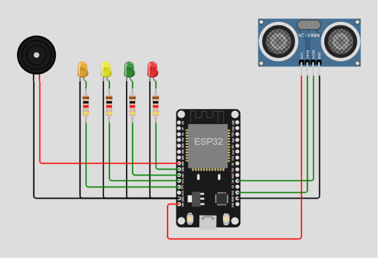

## Kelompok 3

1. Elis Hilmal Muhibah Syawalah - 23552011313
2. Muhammad Fahmi Abdul Majiid - 23552011423
3. Challik Ruben - 23552011333
---

# IoT Smart Flood Detection System

## Deskripsi Project

IoT Smart Flood Detection System adalah sistem deteksi dini banjir berbasis Internet of Things (IoT) yang dirancang untuk memantau ketinggian air secara real-time menggunakan sensor ultrasonik dan mikrokontroler ESP32. Sistem ini mampu mengukur jarak permukaan air, mengirimkan data ke server melalui protokol MQTT, serta memberikan peringatan dini menggunakan LED indikator dan buzzer sesuai tingkat bahaya yang terdeteksi. Dengan adanya sistem ini, pengguna dapat mengetahui potensi banjir lebih cepat sehingga dapat melakukan tindakan pencegahan sebelum kondisi menjadi lebih parah.

---

## Tujuan Project

1. Membuat sistem deteksi banjir secara otomatis.
2. Memonitor ketinggian air secara real-time.
3. Memberikan peringatan dini ketika air mencapai batas bahaya.
4. Menerapkan konsep IoT pada sistem keamanan lingkungan.
5. Membantu pengguna mengetahui potensi banjir lebih cepat.

---

## Fitur Utama

1. Monitoring ketinggian air otomatis: Sensor ultrasonik HC-SR04 digunakan untuk mengukur jarak antara sensor dan permukaan air secara otomatis.
2. Real-time data transmission: Data sensor dikirim secara real-time menggunakan protokol MQTT melalui jaringan WiFi.
3. Smart alarm system: Buzzer akan aktif dengan pola alarm berbeda sesuai tingkat bahaya banjir.
4. LED status indicator: LED digunakan sebagai indikator visual untuk menunjukkan status kondisi air saat ini.
5. IoT monitoring: Data dapat diintegrasikan dengan dashboard monitoring seperti MQTT Explorer.

---

## Komponen Project

| No | Komponen                  | Jumlah     |
| -- | ------------------------- | ---------- |
| 1  | ESP32 DevKit              | 1          |
| 2  | HC-SR04 Ultrasonic Sensor | 1          |
| 3  | LED Hijau                 | 1          |
| 4  | LED Kuning                | 1          |
| 5  | LED Merah                 | 1          |
| 6  | LED Hitam                 | 1          |
| 7  | Active Buzzer             | 1          |
| 8  | Kabel Jumper              | Secukupnya |

---

## Cara Kerja Sistem:

1. Sensor HC-SR04 membaca jarak permukaan air.
2. ESP32 menerima dan memproses data sensor.
3. Sistem menentukan status kondisi banjir.
4. Data dikirim ke MQTT Broker melalui WiFi.
5. LED indikator menyala sesuai status.
6. Buzzer memberikan alarm sesuai tingkat bahaya.
7. Data dapat dipantau secara real-time dari dashboard IoT.

---

## Status Kondisi Banjir

| Jarak Air | Status | Indikator LED | Buzzer |
|-----------|---------|---------------|---------|
| > 100 cm | Aman | Hijau | Mati |
| 51 – 100 cm | Waspada | Kuning | Bunyi Lambat |
| 11 – 50 cm | Siaga | Merah | Bunyi Sedang |
| ≤ 10 cm | Darurat | Hitam | Bunyi Terus-Menerus |

## Penjelasan Sistem

Karena sensor HC-SR04 dipasang di atas permukaan air, nilai jarak yang terbaca akan semakin kecil ketika permukaan air naik. Oleh karena itu:

- Jarak > 100 cm menunjukkan kondisi aman karena permukaan air masih jauh dari sensor.
- Jarak 51–100 cm menunjukkan kondisi waspada karena air mulai meningkat.
- Jarak 11–50 cm menunjukkan kondisi siaga karena air semakin mendekati sensor.
- Jarak ≤ 10 cm menunjukkan kondisi darurat karena ketinggian air sudah sangat dekat dengan sensor.

---

## Konsep Project

Project ini memiliki konsep utama berupa sistem deteksi banjir pintar yang dapat memantau kondisi air menggunakan ESP32.

1. Menerapkan konsep Internet of Things (IoT) untuk sistem deteksi dini banjir.
2. Menggunakan sensor ultrasonik HC-SR04 untuk mengukur jarak antara sensor dan permukaan air.
3. ESP32 berfungsi sebagai mikrokontroler yang memproses data sensor dan menentukan status kondisi banjir.
4. Data ketinggian air dikirim secara real-time melalui jaringan WiFi menggunakan protokol MQTT.
5. MQTT Broker digunakan sebagai media komunikasi antara perangkat IoT dan sistem monitoring.
6. LED indikator digunakan untuk menampilkan status kondisi banjir secara visual.
7. Buzzer digunakan sebagai alarm peringatan dini ketika ketinggian air mencapai level tertentu.
8. Sistem dapat dipantau melalui dashboard monitoring atau aplikasi MQTT secara real-time.
9. Memiliki empat tingkat status kondisi yaitu Aman, Waspada, Siaga, dan Darurat.
10. Dirancang untuk membantu pengguna mendapatkan informasi potensi banjir lebih cepat sehingga dapat melakukan tindakan pencegahan lebih dini.
11. Mendukung implementasi Smart Environment dan sistem mitigasi bencana berbasis teknologi IoT.
12. Dapat dikembangkan lebih lanjut dengan fitur notifikasi otomatis, penyimpanan data cloud, dan aplikasi mobile monitoring.

---

## Model Struktur Rangkaian dan Penjelasan Sistem

Dalam simulasi pada Website WOKWI bentuk struktur rangkaian sistem akan seperti diatas, dengan menggunakan protokol MQTT sebagai perantara pengirim data ke server.
Dimana pada sistem ini program akan menggunakan sensor ultrasonic untuk mendeteksi volume air, dibantu dengan tambahan RTOS dan security (encrypt & decrypt).
4 Led pada sistem digunakan sebagai tolak ukur keadaan volume air, setiap warna menyesuaikan dengan situasi banjir.

